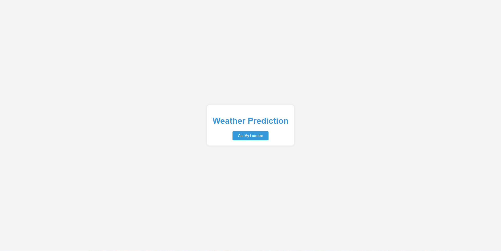

# Team FA_PS


[](LICENSE)
[](https://github.com/yourusername/equine-tracker/stargazers)
[](https://github.com/yourusername/equine-tracker/network/members)
[](https://github.com/yourusername/equine-tracker/issues)
[](https://github.com/yourusername/equine-tracker/pulls)

## Table of Contents

1. [Introduction](#introduction)
2. [Features](#features)
3. [Installation](#installation)
4. [Usage](#usage)
5. [Contributing](#contributing)
6. [License](#license)
7. [Acknowledgments](#acknowledgments)

## Introduction

Welcome to Friendly Weather, the tool that can change the world of "WEATHER FORECASTING"
## Website Preview


## Features

Equine Tracker comes with a wide range of features tailored for horse care:

- **Simple**: Easy and friendly for everyone.
- **Custom your own data**:You can easily edit, improve, even play with the data.
- **Invest in the future**: great idea needs great people so that is why it is open source 


## Installation

To start using Equine Tracker, follow these installation steps:

1. Clone the repository:

   ```bash
   git clone https://github.com/FKQ7/Weather_Prediction-.git
   ```

2. Navigate to the project directory:

   ```bash
   cd Weather_Prediction
   ```

3. Install the required dependencies:

   ```bash
   pip install -r requirements.txt
   ```

4. Start the application:

   ```bash
   python train_model.py
   python app.py
   ```

Then go to "http://127.0.0.1:5000/"

For additional setup instructions and troubleshooting, consult the us 

## Usage

really ease no further clarification,
but if you want to generate data or do custom data just run gymData.py and change train.py and app.py dataset to the new one

## Contributing

We welcome contributions from the Friendly community! If you have ideas for improvements, bug reports, or want to contribute code, let us know

## License

Equine Tracker is open-source software licensed under the Apache License 2.0. For full details, refer to the [LICENSE](LICENSE) file.

## Acknowledgments

We'd like to extend our gratitude to the Frendly Weather community for their support and inspiration.
